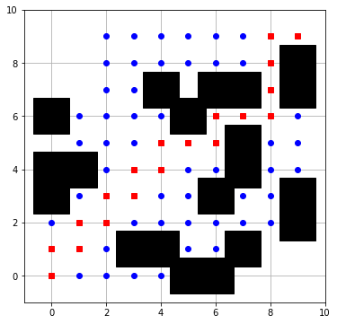
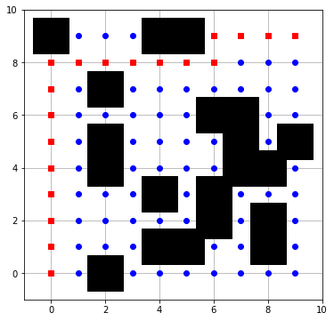
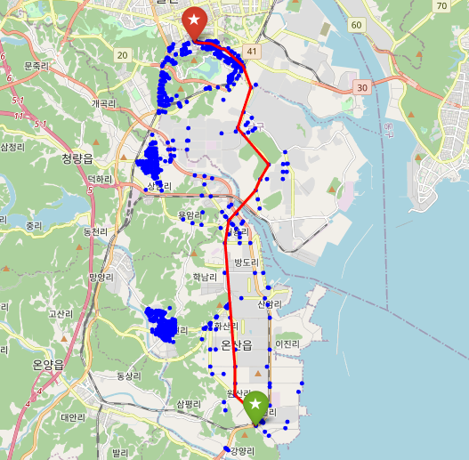
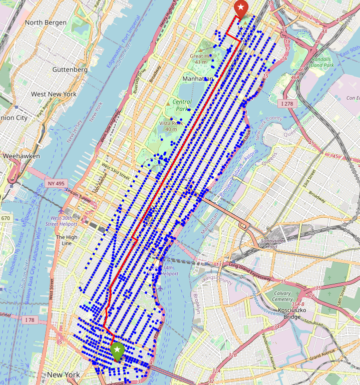

Route Planning Algorithms
==============

Route planning algorithms are used to find feasible (or optimal) path from start node to goal node in graph datastructure. In this repository, you guys can use three types of route planning algorithms: grid world version, simple toy problem version, and real world version.

Python module requirements for visualization
-----

* folium
* networkx
* osmnx

Cautions
-----

* All codes in this repository are written in 2021 (when I was **"novice"** in python). So, there can be lots of unreasonable progamming styples. Please understand.

Details
-----

### 1. Toy Problem

* There are three route planning algorithms: Dijkstra, Bi-directional Dijkstra, Astar
* All versions of route planning algorithm are almost same each other
* This toy problem would be very great example to easily understand "route planning algorithm"

### 2. Grid world

* There are three route planning algorithms: Dijkstra, Astar

### 3. Real world

* There are several types of route planning algorithm:
    * Dijkstra
    * Astar
    * Bi-directional dijkstra
    * Bi-directional dijkstra with modified length
    * Bi-directional astar with consistent approach
* Newyork taxi dataset is used for manhanttan region
* Route planning result with Ulsan road network dataset is implemented with osmnx module (in astar_ulsan.ipynb). You guys can modify this code to any region whatever you want with osmnx module.

Visualization Examples
-----

### Grid version (Astar, Dijkstra)

### Real world version with folium (Ulsan, Korea)

### Real world version with network-x (Manhanttan, Newyork, USA)

Reference
-----

[1] [Dijkstra](https://dl.acm.org/doi/abs/10.1145/3544585.3544600?casa_token=tv0wov33mqsAAAAA%3AMEwRZs1zDOPRaKYVa3VVnndgImcZbjDkfU9jC4mvP3wqFcCt_zyU0azSvnPeNXGW3VZPUw4x4ipsfw): A Note on Two Problems in Connexion with Graphs  
[2] [Astar](https://ieeexplore.ieee.org/abstract/document/4082128/): A Formal Basis for the Heuristic Determination of Minimum Cost Paths   
[3] [Bi-directional dijkstra](https://books.google.co.kr/books?hl=ko&lr=&id=7fYS29re860C&oi=fnd&pg=PA422&dq=Parallel+Bidirectional+Dijkstra%E2%80%99s+Shortest++Path+Algorithm+&ots=60XVWciqTP&sig=8bcA3wFCcugOfVU_PZ897otCjhM&redir_esc=y#v=onepage&q=Parallel%20Bidirectional%20Dijkstra%E2%80%99s%20Shortest%20%20Path%20Algorithm&f=false): Parallel Bidirectional Dijkstra’s Shortest Path Algorithm    
[5] [Bi-directional astar with consistent approach](https://faculty.cc.gatech.edu/~thad/6601-gradAI-fall2012/02-search-Goldberg03tr.pdf): Computing the Shortest Path: A∗ Search Meets Graph Theory   